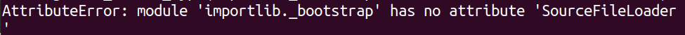
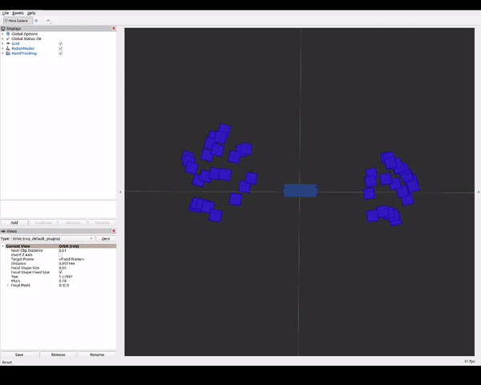

# Introduction
This package provides example code using the published data from the [leapmotion-ros2-wrapper](https://github.com/kimbring2/leapmotion-ros2-wrapper)

Below is visualizng the hand tracking information in RViz2

# Requirements
- Ubuntu 20.04
- ROS2 Foxy
- [leapmotion-ros2-wrapper](https://github.com/kimbring2/leapmotion-ros2-wrapper)

# Build the package
```
$ cd ~/ros2_ws/src/ #use your current ros2 workspace folder
$ git clone --recursive https://github.com/kimbring2/leapmotion-ros2-examples.git
$ cd ..
$ rosdep install --from-paths src --ignore-src -r -y
$ colcon build --symlink-install --cmake-args=-DCMAKE_BUILD_TYPE=Release
```

# Found error and solution
- AttributeError: module 'importlib._bootstrap' has no attribute 'SourceFileLoader'

```$ python3.8 -m ensurepip --upgr```

# Starting the leapmotion_display_rviz2 
Next, visual the hand tracking at the RViz2. Run below command. It will start the leapmotion-ros2-wrapper automatically.

```
$ ros2 launch leapmotion_display_rviz2 display_leapmotion.launch.py
```


